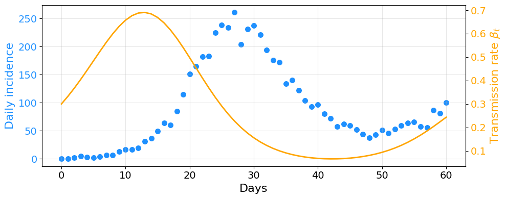
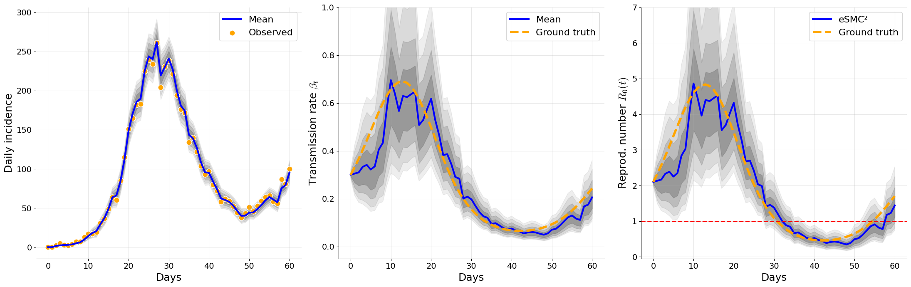
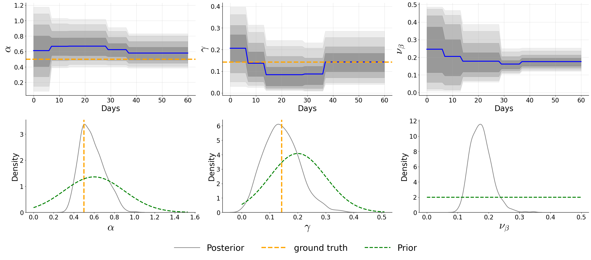

# eSMC²: Ensemble SMC² for Epidemiological Models

This repository contains the implementation of the **Ensemble SMC² (eSMC²)** algorithm for sequential Bayesian inference in state-space epidemiological models, as described in our paper:

"**Accelerated Bayesian inference for state-space epidemiological models with Ensemble SMC²**"

---

## Features
- Joint inference of hidden states and epidemiological parameters.
- Ensemble-based approximation (EnKF) for scalable likelihood evaluation.
- Supports discrete, count-based epidemic data.
- Demonstrated on synthetic datasets and 2022 U.S. monkeypox incidence data.

---

## Installation
Clone the repository:

```bash
git clone https://github.com/Dhorasso/eSMC2_Epi_Inference.git
cd eSMC2_Epi_Inference
```

## Example Usage


#####  Import necessary modules
```python
#####################################################################################
# Application of eSMC² for Experiment 1
# This script loads simulated data and applies the eSMC² algorithm.
#####################################################################################

# === Import necessary libraries ===
import numpy as np
import pandas as pd
import matplotlib.pyplot as plt
from scipy.stats import truncnorm, uniform, norm
from smc2 import ESMC_squared
```
##### Load your data

```python
#####################################################################################
# STEP 1: Load pre-simulated data
#####################################################################################

# Load data generated previously (columns: time, obs, beta_t)
true_theta = [1/2, 1/7]  # alpha, gamma
simulated_data = pd.read_csv("simulated_data1.csv")

## Visulation

# Create figure and axis
fig, ax1 = plt.subplots(figsize=(10, 4))

# --- Left axis: daily incidence (obs) ---
ax1.scatter(simulated_data['time'], simulated_data['obs'], color='dodgerblue', edgecolor='white', s=80)
ax1.set_xlabel('Days', fontsize=16)
ax1.set_ylabel('Daily incidence', color='dodgerblue', fontsize=16)
ax1.tick_params(axis='y', labelcolor='dodgerblue', labelsize=14)
ax1.tick_params(axis='x', labelsize=14) 

ax1.grid(True, alpha=0.3)

# --- Right axis: transmission rate (beta_t) ---
ax2 = ax1.twinx()
ax2.plot(simulated_data['time'], simulated_data['beta_t'], color='orange', lw=2)
ax2.set_ylabel(r'Transmission rate $\beta_t$', color='orange', fontsize=16)
ax2.tick_params(axis='y', labelcolor='orange', labelsize=14)

ax2.tick_params(axis='x',  labelsize=140)

# --- Optional: legends ---
# Combine legends from both axes
handles1, labels1 = ax1.get_legend_handles_labels()
handles2, labels2 = ax2.get_legend_handles_labels()

plt.tight_layout()
plt.show()
```

<p>
  
</p>


#####  Run the eSMC²

```python

#####################################################################################
# STEP 2: Define priors for states and parameters
#####################################################################################

np.random.seed(123)  # Reproducibility

# Initial state priors
# 'VariableName': {
#     'prior': <distribution object>,  # specifies the prior distribution for the variable
#     'transf': <transformation>       # specifies if/how the variable should be transformed (none, log, logit)
# }

state_info = {
    'S': {'prior': truncnorm((0-(500000-10))/0.2, (np.inf-(500000-10))/0.2, loc=500000-10, scale=0.2), 'transf': 'none'},
    'E': {'prior': uniform(loc=0, scale=0), 'transf': 'none'},
    'I': {'prior': truncnorm((0-10)/0.2, (np.inf-10)/0.2, loc=10, scale=0.2), 'transf': 'none'},
    'R': {'prior': uniform(loc=0, scale=0), 'transf': 'none'},
    'Z': {'prior': uniform(loc=0, scale=0), 'transf': 'none'},
    'B': {'prior': truncnorm((0-0.3)/0.01, (np.inf-0.3)/0.01, loc=0.3, scale=0.01), 'transf': 'log'},
}


# Parameter priors
theta_info = {
    'alpha': {'prior': truncnorm((0-0.6)/0.3, (np.inf-0.6)/0.3, loc=0.6, scale=0.3), 'transf': 'log'},
    'gamma': {'prior': truncnorm((0-0.2)/0.1, (np.inf-0.2)/0.1, loc=0.2, scale=0.1), 'transf': 'log'},
    'nu_beta': {'prior': uniform(loc=0, scale=0.5), 'transf': 'log'},
}

# theta_info = {
#     'sigma': {'prior': uniform(0, 1), 'transf': 'log'},
#     'gamma': {'prior': uniform(0, 1), 'transf': 'log'},
#     'nu_beta': {'prior': uniform(0, 1), 'transf': 'log'},
# }

#####################################################################################
# STEP 3: Run the eSMC² algorithm
#####################################################################################

esmc2_results = ESMC_squared(
    initial_state_info=state_info,
    initial_theta_info=theta_info,
    observed_data=simulated_data['obs'],
    num_state_particles=200,
    num_theta_particles=1000,
    # adapt=True
)

# Print the Marginal log-likelihood
print("Marginal log-likelihood:", esmc2_results['margLogLike'])

```

##### Visualization

```python
#####################################################################################
# STEP 4:   State visualization
#####################################################################################

from smc_visualization import*
import matplotlib.pyplot as plt
import seaborn as sns

# --- User settings ---
ci_levels = [50, 75, 90, 95]  # CI levels to plot
mean_color ='blue'
ci_color = 'gray'       
window = 1                    # smoothing window
show_params = True            # whether to plot parameterssimulated_data['Rt'] = simulated_data['beta_t']/true_theta[1] # true reprod. number ( the eff. reprod numer is 
                                                                                # obtain by mutiply by density os susceptible)

# --- Trace trajectories ---
matrix_state = trace_smc(esmc2_results['trajState'])
matrix_theta = trace_smc(esmc2_results['trajtheta'])

gamma = np.mean(matrix_theta['gamma'][:, -1])

# estimate reproduction number=(beta(t)/gamma)
matrix_state['Rt'] = matrix_state['B'] / gamma 


# --- Plot states: NI, B, Rt ---
fig, axs = plt.subplots(1, 3, figsize=(22, 7))

# New infections
plot_smc(matrix_state['Z'], ax=axs[0], mean_color=mean_color, ci_color=ci_color, label='Mean', window=window, ci_levels=ci_levels)
axs[0].scatter(simulated_data['time'], simulated_data['obs'], color='orange', edgecolor='white', s=90, label='Observed')
axs[0].set_xlabel('Days', fontsize=18)
axs[0].set_ylabel('Daily incidence', fontsize=18)
axs[0].tick_params(labelsize=14)

# Transmission rate
plot_smc(matrix_state['B'], ax=axs[1], mean_color=mean_color, ci_color=ci_color, label='Mean', window=window, ci_levels=ci_levels)
axs[1].plot(simulated_data['time'], simulated_data['beta_t'], color='orange', linestyle='--', lw=4, label='Ground truth')
axs[1].set_xlabel('Days', fontsize=18)
axs[1].set_ylabel(r'Transmission rate $\beta_t$', fontsize=18)
axs[1].tick_params(labelsize=14)
axs[1].set_ylim([-0.05, 1])

# Reproduction number
plot_smc(matrix_state['Rt'], ax=axs[2], mean_color=mean_color, ci_color=ci_color, label='eSMC²', window=window, ci_levels=ci_levels)
axs[2].plot(simulated_data['time'], simulated_data['Rt'], color='orange', linestyle='--', lw=4, label='Ground truth')
axs[2].axhline(1, color='r', linestyle='--', lw=2)
axs[2].set_xlabel('Days', fontsize=18)
axs[2].set_ylabel(r'Reprod. number$', fontsize=18)
axs[2].tick_params(labelsize=14)
axs[2].set_ylim([-0.05, 8])

# Theme
for ax in axs:
    ax.spines['top'].set_visible(False)
    ax.spines['right'].set_visible(False)
    ax.set_facecolor('white')
    ax.grid(True, alpha=0.3)
    ax.legend(fontsize=16)

plt.tight_layout()
plt.show()
```
<p>
   
</p>


```python
#####################################################################################
# STEP 5:   Parameter visualization
#####################################################################################


from collections import OrderedDict

# --- User settings ---
mean_color ='blue'
ci_color = 'gray'      # eSMC² color
ci_levels = [50, 75, 90, 95]  # CI levels to plot
fontsize_axis = 25
fontsize_label = 35
fontsize_legend = 28

# --- LaTeX labels mapping (optional) ---
theta_labels = {
    'alpha': r'$\alpha$',
    'gamma': r'$\gamma$',
    'nu_beta': r'$\nu_{\beta}$'
}

# --- Extract priors and bounds from theta_info ---
priors = {theta_labels[k]: v['prior'] for k, v in theta_info.items()}
prior_bounds = {key: priors[key].ppf(0.999) for key in priors.keys()}

# --- Number of parameters ---
N = len(matrix_theta)

# --- Figure setup ---
fig, axs = plt.subplots(2, N, figsize=(9 * N, 12), squeeze=False)
handles, labels = [], []

for i, key in enumerate(matrix_theta.keys()):
    label_key = theta_labels[key]

    # --- Time Series Plot (top row) ---
    plot_smc(matrix_theta[key], ax=axs[0, i], mean_color=mean_color, ci_color=ci_color, label='eSMC²', ci_levels=ci_levels)
    axs[0, i].set_xlabel('Days', fontsize=fontsize_axis)
    axs[0, i].set_ylabel(label_key, fontsize=fontsize_label)

    if 'true_theta' in globals() and i < len(true_theta):
        axs[0, i].axhline(y=true_theta[i], color='orange', linestyle='--', lw=4, label='ground truth')

    axs[0, i].tick_params(axis='x', labelsize=20)
    axs[0, i].tick_params(axis='y', labelsize=20)

    # --- Posterior KDE Plot (bottom row) ---
    data = matrix_theta[key][:, -1]
    sns.kdeplot(data, ax=axs[1, i], color=ci_color, lw=2, label='eSMC²')

    if 'true_theta' in globals() and i < len(true_theta):
        axs[1, i].axvline(true_theta[i], color='orange', linestyle='--', lw=4, label='ground truth')

    # --- Prior density ---
    x_vals = np.linspace(0, max(data.max(), prior_bounds[label_key]), 500)
    axs[1, i].plot(x_vals, priors[label_key].pdf(x_vals), color='green', lw=3, linestyle='--', label='Prior')

    axs[1, i].set_xlabel(label_key, fontsize=fontsize_label)
    axs[1, i].set_ylabel('Density', fontsize=fontsize_axis)
    axs[1, i].tick_params(axis='x', labelsize=20)
    axs[1, i].tick_params(axis='y', labelsize=20)

    # --- Classic theme styling ---
    for ax in [axs[0, i], axs[1, i]]:
        ax.spines['top'].set_visible(False)
        ax.spines['right'].set_visible(False)
        ax.spines['left'].set_linewidth(1.2)
        ax.spines['bottom'].set_linewidth(1.2)
        ax.set_facecolor('white')

    # Legend handles
    h, l = axs[1, i].get_legend_handles_labels()
    handles.extend(h)
    labels.extend(l)

# Deduplicate legend
by_label = OrderedDict(zip(labels, handles))

# Legend below all subplots
fig.legend(
    by_label.values(), by_label.keys(),
    loc='lower center',
    fontsize=fontsize_legend,
    ncol=4,
    frameon=False,
    markerscale=3,
    handlelength=3,
    handletextpad=0.8
)

plt.tight_layout(h_pad=2, rect=[0, 0.1, 1, 1])
plt.show()
```
<p>
   
</p>


